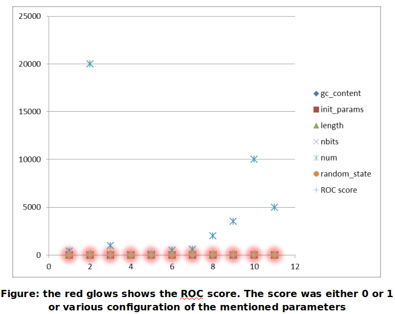

# DeepRNA

Application to predict RNA structures from sequences. The sequences are synthetically created and a Deep Neural Network is trained to predict the secondary RNA structure from a sequence. A single RNA strand can can fold into millions of secondary RNA structures. A better structure is categorized by having minimum energy. The project is more focussed on tuning the hyper parameters to increase the prediction accuracy.

## Abstract

The application attempts to predict correct RNA structures in terms of its features. 
 

## Introduction

RNA (ribonucleic acid) is a nucleic acid that carries instructions from DNA for controlling the synthesis of proteins. The acid can fold into various secondary structures. RNA folding is the process by which a linear ribonucleic acid (RNA) molecule acquires secondary structure through intra-molecular interactions. The folded domains of RNA molecules are often the sites of specific interactions with proteins in forming RNA–protein (ribonucleoprotein) complexes. The secondary structure of a nucleic acid molecule refers to the basepairing interactions within a single molecule or set of interacting molecules, and can be represented as a list of bases which are paired in a nucleic acid molecule. Prediction of possible RNA structures is a major challenge. Features in the secondary structure include hair pin loops, internal loop, bulge etc.
 

## Neuralnetwork for DeepRNA

The neural network object is mainly focused to test and predict the structures for input RNA sequences. It has a standard scalar, sequence pre processor and the various parameters for testing the network. The standardscalar standardize features by removing the mean and scaling to unit variance. The network can also save and load any of its instances tried on a set of parameters. The sequences are explicitly dealt my the network object where the sequences are converted into matrix form as a standard format accepted by the network. For this we make use of the seq preprocessor that converts the sequences to graphs and a vectorizer that further converts the graph in matrix form. During training we fit the sequence matrix to its equivalent structure matrix for one of the input sequences and during testing we predict the structure matrix for input sequence matrix for the second half. The fit and predict takes care of this transformation implicitly before fitting and predicting respectively. The fitpredict is more concerned with model creation based on the network training. 
 

## Transformer

Making use of transformer we convert the second half of the sequences to structure data matrix. Basically it contains the struct preprocessor, vectorizer and a set of parameters for the vectorizer that includes the maximal distance size of sequences(d_seq), the maximal distance size of structure(d_struct), the minimal radius size(min_r), normalization(If set the resulting feature vector will have unit Euclidean norm), inner_normalization (If set the feature vector for a specific combination of the radius and distance size will have unit Euclidean norm), the number of bits that defines the feature space size for sequence(nbits_seq) , the number of bits that defines the feature space size for structure(nbits_struct) and radius. The sequences are first converted into graphs and further we vectorize them to data matrices. For training the network we normally randomize these parameters setting to test for various configurations. We standardize the structure data matrix using softmax as it limits the range within 0 and 1. 
 

## NetworkOptimizer

The optimizer focuses on optimizing the network to yield better prediction results. It holds all the parameters for vectorizer and the network. Network parameters mainly comprises of number of bits, number of hidden features, number of output features, number of layers for the network, type of regularization to avoid overfitting, optimum learning rate, batch size(Number of training samples to group together when performing stochastic gradient descent) , dropout rate(another way to regularize) etc. The optimizer takes the input sequences and split them into training and testing sequences. The training sequences are transformed to structure data matrix and so the testing sequences using the transformer. These are fed to the neural network where we fit the training sequences and predict using the testing ones. These are further evaluated using ROC where we test the test-structure data matrix with the predicted structure data matrix in terms of its features modelled as real numbers for the network. These are depicted in terms of ROC mean and variance. Our effort is to obtain a 50% mean and as low variance as possible. Once the model is ready we use it with a complete new set of sequences. As a part of its function it also saves a model in the runtime that provides an optimized ROC score. The ROC normally stands for Receiver Operating Characteristics. Ideally it’s a graphical plot that illustrates the performance of a binary classifier as its discrimination threshold is varied. In context to the RNA structures it provides a desired value under the scenario when the model will not be able to classify both the secondary structures in terms of its features.
 

## Logging

Each of the activities performed by the prototype is logged in the directory. For convenience the model creation and its associated ROC scores are also logged that can be turned off eventually. This was mainly done to keep a track of the training process. The logging also contains the parameters used with respect to a model that includes the GC content, length of the sequence, the logging directory, number of bits, random number to generate the random seed, verbosity, number of times parameter initialization etc. Its main purpose is to keep a track of the performance of the trained model on unseen data. 
 

## Fabrication of RNA sequences

The RNA sequences used in the application are basically created rather than importing from a database. We generate the RNA sequences using a list containing G, C, A, U appending them with the number of times they appear in one sequence and randomly shuffle their content to arrive with different sequences. 
 

## Results

For different parameter settings we get different results. 
 

</ p>
 

## Conclusion

The performance of the model did not reach the expected mark. This can be attributed to insufficient training data or to poor parameters tuning. The prototype still needs a little more enhancement in the above two sectors if needed to perform up to expectation. The results are logged in the directory but we have modelled here in graphical form for easy understanding.
